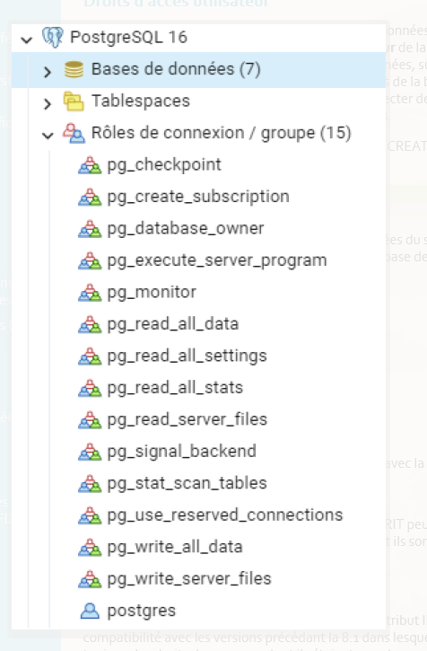

# Administrer son serveur de bases de données

## Objectifs de la séquence
L’objectif est d’assurer :

- la **pérennité des données**
- la **cohérence des données**
- la **sécurité et la performance du serveur de bases de données**

---

# Concept général de l'administration

L’administration d’un système de bases de données nécessite de distinguer :

- la **gestion du serveur**
- la **gestion des bases de données**

Elle implique plusieurs aspects :

- les métiers autour des bases de données
- le système d’exploitation du serveur
- la gestion d’une base **de développement** et d’une base **de production**

---

# Étapes de création d’un système de base de données

1. Établir les caractéristiques de la base  
2. Évaluer le matériel serveur  
3. Installer PostgreSQL / PostGIS  
4. Créer et ouvrir la base de données  
5. Mettre en place la sauvegarde  
6. Créer et gérer les utilisateurs et leurs droits  
7. Implémenter la structure de la base  
8. Sauvegarder la base fonctionnelle  
9. Optimiser les performances

---

# Architecture et arborescence PostgreSQL

Une installation PostgreSQL contient plusieurs éléments :

- **data** → stockage des données
- **configuration** → fichiers de configuration
- **binaires** → programmes exécutables

---

# Focus sur les tablespaces

Les **tablespaces** permettent de définir un emplacement physique sur le disque pour stocker les données.

Ils permettent :

- d’organiser le stockage
- d’améliorer les performances
- de répartir les données sur plusieurs disques

---

# Le rôle du DBA (Database Administrator)

Le DBA est responsable de :

- la gestion des droits utilisateurs
- la gestion des tablespaces
- la gestion de l’espace disque
- l’identification des tables critiques
- la gestion des sauvegardes
- la performance et la disponibilité de la base

---

# Manipulations courantes

L’administration PostgreSQL comprend notamment :

- optimisation du serveur avec **PGTune**
- gestion des **tablespaces**
- création de bases de données
- création de bases **template**
- création d’utilisateurs
- création de tables
- création d’index
- affectation des objets aux tablespaces

---

# Concept d'administration : différence entre SG et DB

## Composants d’une base de données (DB)

Une base de données contient :

- les **modèles de données** (MCD, MLD, MPD)
- les **schémas**
- les **tables et données**
- les **applications clientes**
- les **utilisateurs (roles)**
- les **requêtes SQL**
- les **index**

---

## Composants du système de gestion (SG)

Le système de gestion comprend :

- l’architecture du serveur
- le réseau
- le CPU
- la RAM
- le stockage
- le système d’exploitation

---

# Les métiers autour de la base de données

Selon la taille de l’entreprise, plusieurs rôles existent :

- **Administrateur système (SI)**
- **Administrateur de base de données (DBA)**
- **Développeur d’application**
- **Utilisateur**

---

# Système d'exploitation du serveur

PostgreSQL peut être installé sur :

- **Linux**
- **Windows**

Téléchargement :

https://www.postgresql.org/download/

Linux (Debian / Ubuntu) :

https://www.postgresql.org/download/linux/ubuntu/

Windows :

https://www.postgresql.org/download/windows/

---

# Base de développement et base de production

## Base de développement (DEV)

Le serveur de développement permet :

- de tester les fonctionnalités
- de corriger les erreurs
- d’expérimenter sans risque

Caractéristiques :

- données simplifiées
- environnement isolé
- travail collaboratif

---

## Base de production (PROD)

La base de production est l’environnement réel utilisé par les utilisateurs.

Avant la production, on utilise souvent un serveur :

**préproduction (staging)**

Il permet de :

- tester dans un environnement réel
- détecter les bugs
- valider les mises à jour

---

# Étapes détaillées de création d’une base

## 1. Établir les caractéristiques

Déterminer les objectifs de la base.

Exemple pour un géomaticien :

- stockage de données **spatiales**

---

## 2. Évaluation du matériel serveur

Cela dépend :

- du volume de données
- du nombre d’utilisateurs
- du type de données

Exemple :

- images satellites
- couches vectorielles

---

## 3. Installation PostgreSQL

Selon le système :

- installation via packages
- compilation des sources

Clients possibles :

- **psql**
- **pgAdmin**
- **DBeaver**
- **QGIS**
- **applications web**

---

## 4. Création de la base

PostgreSQL utilise un **cluster**.

Un cluster est l’ensemble des bases stockées dans un dossier.

Exemple :

```
/var/lib/postgresql/16/main
```

Les tablespaces permettent ensuite d’organiser le stockage.

---

## 5. Stratégie de sauvegarde

Deux types :

### Sauvegarde manuelle

avec :

```
pg_dump
```

### Sauvegarde automatisée

avec des scripts.

---

## WAL (Write Ahead Log)

Les transactions sont enregistrées dans les **WAL**.

Ils contiennent :

- l’historique des opérations
- les modifications des données

Ils garantissent :

- la cohérence
- la récupération après crash

---

## 6. Gestion des utilisateurs

Création d’utilisateurs :

```sql
CREATE ROLE
CREATE USER
```

Le nombre maximal de connexions est défini dans :

```
postgresql.conf
```

---

## 7. Implémentation de la base

Cela comprend :

- modification de la structure
- ajout de données
- suppression de données

Ces opérations doivent être testées avant la mise en production.

---

## 8. Sauvegarde automatique

Une base en production doit être sauvegardée automatiquement.

Exemples :

https://github.com/DiouxX/script_backup_postgresql

http://nils.hamerlinck.fr/blog/2015/05/04/backup-automatique-base-postgresql/

---

## 9. Optimisation des performances

Optimisation PostgreSQL :

- mémoire
- index
- parallélisme
- tablespaces

Outil :

**PGTune**

https://pgtune.leopard.in.ua/

---

# Fichiers importants PostgreSQL

## OID

Chaque objet PostgreSQL possède un identifiant **OID**.

Les données sont stockées dans :

```
C:\Program Files\PostgreSQL\17\data\base
```

---

## pg_hba.conf

Ce fichier gère :

- l’authentification
- les connexions utilisateurs
- les machines autorisées

Exemple :

```
192.168.1.10/32
```

---

## postgresql.conf

Fichier principal de configuration.

Il permet de configurer :

- les performances
- la mémoire
- les connexions
- la sécurité du serveur


----


---- 

binaire c serveur interne 

# Les principaux binaires de PostgreSQL
pg_ctl (réalisé par les installateurs comme systemD ou celui de windows)

    gestion de l'instance / cluster

    start / stop / kill

    init : création autre espace de datas

    promote : promotion de standby

# psql

    le premier client de connexion en mode CLI

    on se connecte avec un utilisateur à une base de donnée

    on peux exécuter du SQL et des méta-commandes, ou des script sql (fichiers)

# Exemple
# pg_createcluster

    création d'une instance PG

    Création des répertoires (/etc et /var/lib)

Accompagné de pg_dropcluster (suppression de cluster), pg_lscluster (lister), pg_ctlcluster (contrôleur du cluster)

# Les binaires pour la sauvegarde (PostgreSQL)

PostgreSQL fournit plusieurs **outils binaires** permettant de sauvegarder, restaurer et maintenir une base de données.

---

# pg_dump

Outil utilisé pour **sauvegarder une base de données**.

Caractéristiques :

- sauvegarde d'une **base spécifique**
- plusieurs **formats de sortie**
- possibilité de sauvegarder **table, schéma ou base complète**

Formats possibles :

- **plain text** → script SQL lisible
- **custom / binaire** → format spécifique PostgreSQL
- **compressé**

### Exemple : sauvegarder une base en SQL

```
pg_dump -U postgres -d ma_base > sauvegarde.sql
```

### Exemple : sauvegarde en format compressé

```
pg_dump -U postgres -Fc ma_base > sauvegarde.dump
```

### Exemple : sauvegarder une seule table

```
pg_dump -U postgres -t ma_table ma_base > table.sql
```

---

# pg_dumpall

Outil permettant de **sauvegarder l'ensemble du serveur PostgreSQL**.

Il sauvegarde :

- toutes les bases
- les utilisateurs (roles)
- les permissions

### Exemple

```
pg_dumpall -U postgres > sauvegarde_complete.sql
```

---

# pg_restore

Permet de **restaurer une base sauvegardée avec pg_dump** (format custom ou binaire).

### Exemple : restauration

```
pg_restore -U postgres -d ma_base sauvegarde.dump
```

### Exemple avec création automatique de la base

```
pg_restore -U postgres -C -d postgres sauvegarde.dump
```

---

# Wrappers (raccourcis PostgreSQL)

Ce sont des **commandes simplifiées** pour gérer les bases et utilisateurs.

### createdb

Créer une base de données

```
createdb ma_base
```

### dropdb

Supprimer une base

```
dropdb ma_base
```

### createuser

Créer un utilisateur

```
createuser mon_user
```

### dropuser

Supprimer un utilisateur

```
dropuser mon_user
```

---

# Maintenance

PostgreSQL propose plusieurs outils de maintenance.

### reindexdb

Permet de **reconstruire les index** pour améliorer les performances.

```
reindexdb ma_base
```

### vacuumdb

Permet de **nettoyer la base de données** et libérer l’espace disque.

```
vacuumdb ma_base
```

Exemple complet :

```
vacuumdb -U postgres -d ma_base -f -z
```

---

# Attention : outils système avancés

Ces commandes sont utilisées pour **l'administration avancée du serveur**.

---

## pg_controldata

Permet de **vérifier l'état du cluster PostgreSQL**.

Il affiche :

- version PostgreSQL
- état du serveur
- informations WAL

Exemple :

```
pg_controldata /var/lib/postgresql/16/main
```

---

## pg_resetwal

Permet de **réinitialiser les journaux WAL en cas de crash**.

⚠️ Attention : peut entraîner **une perte de données**.

Exemple :

```
pg_resetwal /var/lib/postgresql/16/main
```

---

## pg_receive_wal

Permet de **récupérer les WAL d'un serveur distant** (réplication).

Exemple :

```
pg_receivewal -h serveur -U postgres -D /backup/wal
```

---

## pg_basebackup

Permet de **copier une base complète depuis un serveur PostgreSQL**.

Utilisé pour :

- réplication
- sauvegarde complète

Exemple :

```
pg_basebackup -h serveur -U postgres -D /backup/base -Fp -Xs -P
```

Options :

- **-Fp** → format plain
- **-Xs** → inclure les WAL
- **-P** → afficher la progression

 

# Administration PostgreSQL – Pratique

Cette fiche présente les principales manipulations réalisées pour administrer un serveur **PostgreSQL / PostGIS** : connexion au serveur, création de base, configuration, gestion des tablespaces et sauvegarde des données.

---

# Les contrôles d'accès
Droits d'accès utilisateur

PostgreSQL™ gère les droits d'accès aux bases de données en utilisant le concept de rôles. Un rôle peut être vu soit comme un utilisateur de la base de données, soit comme un groupe d'utilisateurs de la base de données, suivant la façon dont le rôle est configuré. Les rôles peuvent posséder des objets de la base de données (par exemple des tables et des fonctions) et peuvent affecter des droits sur ces objets à d'autres rôles pour contrôler qui a accès à ces objets.

La création d'un utilisateur se fait par la commande CREATE ROLE ou avec l'interface de pgAdmin

```
CREATE ROLE nom_utilisateur LOGIN;
```
Les rôles sont communs à toutes les bases de données du serveur, autrement dit, les rôles sont définis au niveau du serveur et pas d'une base de données :



# Les rôles de groupe

Un rôle peut être défini comme rôle de groupe.

Après l'avoir créé, on peut lui ajouter des membres avec la commande :
```
GRANT role_groupe TO role1,... ;
```

Les rôles membres qui ont l'attribut INHERIT peuvent utiliser automatiquement les droits des rôles dont ils sont membres, ceci incluant les droits hérités par ces rôles.

L'attribut NOINHERIT enlève l'héritage.

Par défaut, PostgreSQL™ donne à tous les rôles l'attribut INHERIT pour des raisons de compatibilité avec les versions précédant la 8.1 dans lesquelles les utilisateurs avaient toujours les droits des groupes dont ils étaient membres.

Un rôle de groupe n'a pas besoin d'avoir un droit de connexion à la base (LOGIN), ce sont les utilisateurs de ce groupe qui se connectent.


## Attributs des rôles

droit de connexion

Seuls les rôles disposant de l'attribut LOGIN peuvent se connecter à une base de données.

statut de super-utilisateur

Les super-utilisateurs ne sont pas pris en compte dans les vérifications des droits, sauf le droit de connexion ou d'initier la réplication.

création de bases de données

Les droits de création de bases doivent être explicitement données à un rôle (à l'exception des super-utilisateurs qui passent au travers de toute vérification de droits).

création de rôle

Un rôle doit se voir explicitement donné le droit de créer plus de rôles (sauf pour les super-utilisateurs vu qu'ils ne sont pas pris en compte lors des vérifications de droits).

initier une réplication

Un rôle doit se voir explicitement donné le droit d'initier une réplication en flux (sauf pour les super-utilisateurs, puisqu'ils ne sont pas soumis aux vérifications de permissions). Un rôle utilisé pour la réplication en flux doit avoir le droit LOGIN.

mot de passe

Le client doit fournir un mot de passe quand il se connecte à la base.

## Modification d'un rôle

Les attributs d'un rôle peuvent être modifiés après sa création avec ALTER ROLE.

## Les privilèges (GRANT)
Un privilège est un droit sur un objet de la base attribué à un rôle.

Les SGBD permettent généralement de spécifier assez finement les privilèges d'un utilisateur en fonction des objets manipulés :

    base de données

    schéma

    table (relation)

    colonne (attribut)

Ainsi, un utilisateur peut se voir attribuer un privilège pour toute une base de données, le contenu d'un schéma, ou seulement pour quelques tables, ou encore sur uniquement quelques colonnes de certaines tables.


## Règles d'attribution des privilèges

Règle n°0 : un mot de passe pour chacun

Tous les utilisateurs (clients, applications) doivent avoir un mot de passe.

Règle n°1 : attribution du moindre privilège.

Les utilisateurs ne doivent avoir que le minimum de droits, ceux strictement nécessaires à l'accomplissement de leurs tâches. Les privilèges peuvent évoluer au cours du temps car les besoins et les tâches affectées ne sont pas immuables, mais à un moment donné, seuls les droits indispensables doivent être fournis à un utilisateur.

Il faut éviter de créer plusieurs comptes avec des droits d'administrateur.

Règle n°2 : contrôle de la population.

Le personnel d'une entreprise bouge, il y a des départs, des arrivées, des promotions... Les privilèges doivent êtres synchrones avec la réalité de la population : il faut supprimer les comptes des utilisateurs quittant l'entreprise et de ceux n'étant plus affectés à telle ou telle tâche.

Règle n°3 : supervision de la délégation des tâches d'administration.

Un administrateur peut être amené à déléguer auprès d'une autre personne les tâches d'attribution des privilèges de tout ou partie de la population des utilisateurs (cf WITH GRANT OPTION). Un contrôle a posteriori doit être réalisé afin de vérifier que le résultat de cette délégation est conforme à la politique adoptée.

Règle n°4 : contrôle physique des connexions.

La connexion d'un utilisateur à une base de données peut être réalisée depuis n'importe où dans le monde grâce à Internet. Il est nécessaire de restreindre les connexions à des hôtes spécifiques connus (hba_conf).

## Les principaux privilèges :

Les droits possibles sont :

SELECT

Autorise une sélection sur toutes les colonnes, ou sur les colonnes listées spécifiquement, de la table, vue ou séquence indiquée. Autorise aussi l'utilisation de COPY TO. De plus, ce droit est nécessaire pour référencer des valeurs de colonnes existantes avec UPDATE ou DELETE.

INSERT

Autorise une insertion d'une nouvelle ligne dans la table indiquée. Si des colonnes spécifiques sont listées, seules ces colonnes peuvent être affectées dans une commande INSERT, (les autres colonnes recevront par conséquent des valeurs par défaut). Autorise aussi COPY FROM.

UPDATE

Autorise une mise à jour sur toute colonne de la table spécifiée, ou sur les colonnes spécifiquement listées. (En fait, toute commande UPDATE nécessite aussi le droit SELECT car elle doit référencer les colonnes pour déterminer les lignes à mettre à jour et/ou calculer les nouvelles valeurs des colonnes.)

DELETE

Autorise la suppression d'une ligne sur la table indiquée. (En fait, toute commande DELETE nécessite aussi le droit SELECT car elle doit référencer les colonnes pour déterminer les lignes à supprimer.)

TRUNCATE

Autorise la suppression de tous les enregistrements de la table.

REFERENCES

Ce droit est requis sur les colonnes de référence et les colonnes qui référencent pour créer une contrainte de clé étrangère. Le droit peut être accordé pour toutes les colonnes, ou seulement des colonnes spécifiques.

TRIGGER

Autorise la création d'un déclencheur sur la table indiquée.

CREATE

Pour les bases de données, autorise la création de nouveaux schémas dans la base de données.

Pour les schémas, autorise la création de nouveaux objets dans le schéma. Pour renommer un objet existant, il est nécessaire d'en être le propriétaire et de posséder ce droit sur le schéma qui le contient.

Pour les tablespaces, autorise la création de tables, d'index et de fichiers temporaires dans le tablespace et autorise la création de bases de données utilisant ce tablespace par défaut. (Révoquer ce privilège ne modifie pas l'emplacement des objets existants.)

CONNECT

Autorise l'utilisateur à se connecter à la base indiquée. Ce droit est vérifié à la connexion (en plus de la vérification des restrictions imposées par pg_hba.conf).

TEMPORARY, TEMP

Autorise la création de tables temporaires lors de l'utilisation de la base de données spécifiée.

EXECUTE

Autorise l'utilisation de la fonction indiquée et l'utilisation de tout opérateur défini sur cette fonction. C'est le seul type de droit applicable aux fonctions. (Cette syntaxe fonctionne aussi pour les fonctions d'agrégat)

ALL PRIVILEGES

Octroie tous les droits disponibles en une seule opération. Le mot clé PRIVILEGES est optionnel sous PostgreSQL™ mais est requis dans le standard SQL.

La commande SQL GRANT permet de définir les droits :
CTRL+C pour copier, CTRL+V pour coller


--syntaxe générale : 

GRANT { { SELECT | INSERT | UPDATE | DELETE | TRUNCATE | REFERENCES | TRIGGER }

    [, ...] | ALL [ PRIVILEGES ] }

    ON { [ TABLE ] table_name [, ...]
         | ALL TABLES IN SCHEMA schema_name [, ...] }


    TO role_specification [, ...] [ WITH GRANT OPTION ]


GRANT { { SELECT | INSERT | UPDATE | REFERENCES } ( column_name [, ...] )
    [, ...] | ALL [ PRIVILEGES ] ( column_name [, ...] ) }
    ON [ TABLE ] table_name [, ...]
    TO role_specification [, ...] [ WITH GRANT OPTION ]


## Connexions distantes
Foreign Data Wrappers

Le FDW (Foreign Data Wrapper) natif de PostgreSQL postgres_fdw permet d'accéder aux tables à partir de serveurs PostgreSQL distants de manière très transparente.

Le FDW standard PostgreSQL permet également à la géométrie PostGIS de passer des hôtes distants aux hôtes locaux, ce qui est très pratique.

Données externes présentées comme des tables ;

En lecture/écriture (si supporté par le driver et à partir de PostgreSQL 9.3) :

    PostgreSQL, Oracle, MySQL (lecture/écriture)

    fichier CSV, fichier fixe (en lecture)

    ODBC, JDBC, Multicorn

    CouchDB, Redis (NoSQL)


```
    --création d'un lien vers la base de données bd_test_postgis
CREATE SERVER foreign_bd
        FOREIGN DATA WRAPPER postgres_fdw
        OPTIONS (host 'localhost', port '5434', dbname 'bd_test_postgis');
--associer un utilisateur de la base de données distant à un utilisateur en local
CREATE USER MAPPING FOR postgres --utilisateur local
        SERVER foreign_bd
        OPTIONS (user 'postgres', password 'postgres'); --utilisateur distant
--création d'un table ayant la même structure que la table distante		
CREATE FOREIGN TABLE foreign_parkings (
    osm_id integer NOT NULL,
    date_heure timestamp without time zone,
    nom character varying ,
    type_obj character varying,
    xcoord double precision,
    ycoord double precision,
    geom geometry(Point,2154)
)
    SERVER foreign_bd
        OPTIONS (schema_name 'parkings', table_name 't_parking');
select * from foreign_parkings;

```


# conseil

L'accès aux données des tables étrangères est plus lent et donc réservées à des accès intermittents (impossible de créer un index sur une table étrangère).

Il peut être pertinent d'encapsuler les tables distantes dans des vues matérialisées qui stockent les données en local.

## Un FDW sur un WFS
```
Jouons avec les données de l'INPN => http://ws.carmencarto.fr/WFS/119/fxx_inpn

Extension

En pré-requis, il faut que l'extension soit ajoutée (ça tombe bien nous l'avions prévue dans notre template).

CREATE EXTENSION IF NOT EXISTS ogr_fdw;

Création du serveur

DROP SERVER IF EXISTS fdw_ogr_inpn_metropole;

CREATE SERVER fdw_ogr_inpn_metropole

FOREIGN DATA WRAPPER ogr_fdwOPTIONS (

datasource 'WFS:http://ws.carmencarto.fr/WFS/119/fxx_inpn?',

format 'WFS'

);

Création d'un schéma dédié

CREATE SCHEMA IF NOT EXISTS inpn_metropole;

Récupération de l'ensemble des couches WFS comme des tables dans le schéma inpn_metropole

IMPORT FOREIGN SCHEMA ogr_all

FROM SERVER fdw_ogr_inpn_metropoleINTO inpn_metropoleOPTIONS (

-- mettre le nom des tables en minuscule et sans caractères bizarres

launder_table_names 'true',

-- mettre le nom des champs en minuscule

launder_column_names 'true');
```